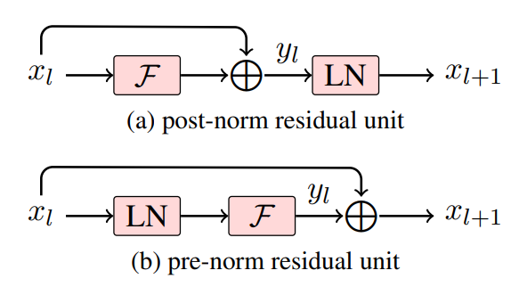

# Layernorm2D forward

This folder contains example for Layernorm2D forward using `ck_tile` tile-programming implementation.

# Implementation and feature support

## welford online algorithm
We use welfold algorithm to update `mean`/`variance` block by block. For `N <=4096` case we can compute `mean`/`var`/`normalization` within one loop, we call it `one-pass`. For large N case, it is hard to keep `mean`/`var` inside register/LDS and then computation `normalization`, so we need to load input twice, first time to compute `mean`/`var` block-by-block, then load input another time to compute the `normalization`. We call it `two-pass`.

## mean/variance save
In training case the mean/variance need to store out (TBD, not supported yet)

## prenorm/postnorm



since [prenorm/postnorm](https://arxiv.org/pdf/1906.01787) is quite common in LLM blocks, this example also support this feature. Note that `prenorm`/`postnorm` always need to fuse a `shortcut` before the actual layernorm computation, the only difference is whether to store the added element to global, `prenorm` need this. You can use `-fadd=1` to test `prenorm`(pre-add+store), or `-fadd=2` to test `postnorm`(pre-add)

## build
```
# in the root of ck_tile
mkdir build && cd build
sh ../script/cmake-ck-dev.sh  ../ <arch>  # you can replace this <arch> to gfx90a, gfx942...
make tile_example_layernorm2d_fwd -j
```
This will result in an executable `build/bin/tile_example_layernorm2d_fwd`

## example
```
args:
          -m    m dimension (default:3328)
          -n    n dimension (default:4096)
     -stride    stride per row, if -1 then equal to n (default:-1)
          -e    epsilon (default:1e-5)
    -save_mv    save mean/variance(invstd) or not. set to 1 in training case (default:0)
          -v    cpu validation or not (default:1)
      -kname    print kernel name or not (default:1)
     -prec_i    input precision (default:fp16)
     -prec_o    output precision, set auto will be the same as input (default:auto)
       -fadd    fused-add, 0:no fused add, 1:fused-prenorm(preadd+store), 2:fused-postnorm(preadd) (default:0)
     -fsweep    fused-sweep (default:0)

```
